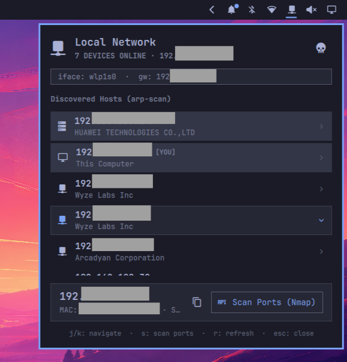
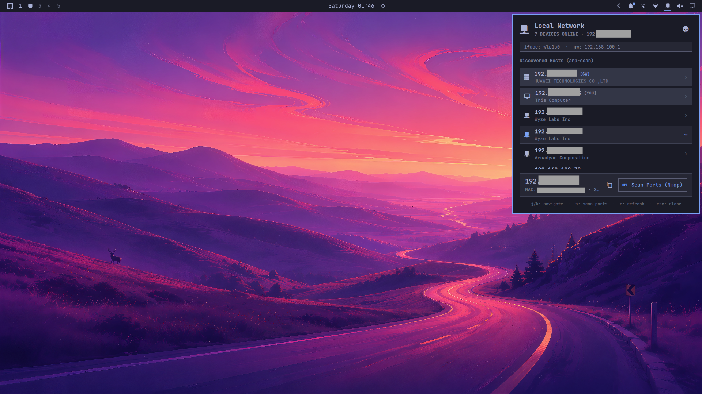

# Omarchy Network Scanner 󰛳

A native, lightweight, and elegant **Network Scanner & Port Inspector plugin** for the **Omarchy Desktop Environment**.

Designed to complement the Omarchy Wi-Fi menu, this plugin lives right on your top bar as a dedicated status widget. It discovers all devices connected to your local Wi-Fi / Ethernet subnet in real-time using high-speed ARP scanning, and offers on-demand targeted Nmap port and service inspection with zero bloat.

---

## ✨ Features

- **⚡ Fast Local Network Discovery**: Discovers all active IP and MAC addresses in ~1.5 seconds using `arp-scan` (with automatic fallback to kernel neighbor tables).
- **🎯 Targeted On-Demand Port Scanning**: Adheres strictly to a privacy-first, low-noise philosophy. Nmap port and service inspection is **never** run across the entire network—only on explicit user demand for a selected host.
- **🎨 100% Native Omarchy Aesthetic**: Built directly with Quickshell and Omarchy's design system (`qs.Commons`, `qs.Ui`, `BorderSurface`). Features dark background styling, subtle accents, monospace typography, and clean negative space.
- **🔍 Smart Device Categorization**: Automatically identifies and badges Gateways (`[GW]`), Local Host (`[YOU]`), Mobile devices, Computers, and Smart IoT devices based on OUI vendor signatures.
- **⌨️ Complete Keyboard & Mouse Control**: Full navigation support via <kbd>j</kbd> / <kbd>k</kbd>, <kbd>↑</kbd> / <kbd>↓</kbd>, <kbd>s</kbd> (Scan), <kbd>c</kbd> (Copy), <kbd>r</kbd> (Refresh), and <kbd>Esc</kbd>.
- **📋 Instant Utilities**: 1-click IP copy to clipboard (`wl-copy`) and instant browser launch for web services (HTTP 80/8080/443).
- **🚀 CLI Companion Included**: Includes the `omarchy-netscan` terminal utility to toggle the UI or run text scans directly in your shell.

---

## 📸 Preview

The Network Scanner widget lives right on your Omarchy top bar and opens a native, dark-themed popup:



*For a full desktop context:*



---

## 📦 Requirements

The plugin relies on standard, unprivileged network utilities available in Arch Linux / Omarchy:

```bash
sudo pacman -S arp-scan nmap python
```

> **Note**: To allow `arp-scan` to perform raw socket scanning without prompting for `sudo`, you may grant it the `cap_net_raw` capability (optional):
> ```bash
> sudo setcap cap_net_raw+p $(which arp-scan)
> ```
> `install.sh` will ask for your explicit confirmation before modifying this system-wide binary. If you decline, the plugin still works — `arp-scan` will simply run with standard privileges (you may need to run it under `sudo` instead).

---

## 🛠️ Installation

### Method 1: Using Omarchy CLI (Recommended)

```bash
omarchy plugin add https://github.com/LuisGuevaraGtz/omarchy-netscan.git
```

### Method 2: Manual Installation

1. Clone this repository into your Omarchy plugins folder:
```bash
git clone https://github.com/LuisGuevaraGtz/omarchy-netscan.git ~/.config/omarchy/plugins/lu15ggtz.netscan
```

2. Run the automated setup script:
```bash
cd ~/.config/omarchy/plugins/lu15ggtz.netscan
./install.sh
```

3. Ensure the plugin widget is added to your bar layout in `~/.config/omarchy/shell.json`:
```json
{
  "bar": {
    "layout": {
      "right": [
        { "id": "omarchy.network" },
        { "id": "lu15ggtz.netscan" },
        { "id": "omarchy.audio" }
      ]
    }
  }
}
```

The installer will ask for your explicit confirmation before adding the widget
to `~/.config/omarchy/shell.json`. If you decline, the plugin is installed but
not shown on your bar; enable it later with:

```bash
omarchy plugin enable lu15ggtz.netscan
```

Once enabled, Omarchy's shell detects the plugin and renders the `󰛳` icon on your top bar.

---

## 🗑️ Uninstall

To fully remove the plugin (plugin files, CLI wrapper, and bar widget entry):

```bash
./uninstall.sh
```

This reverses everything the installer created. It does **not** remove the
system packages (`arp-scan`, `nmap`, `python`), and it will only revoke
`cap_net_raw` from `arp-scan` if you explicitly confirm — since that capability
may be shared with other tools.

> **Tip**: You can also simply delete the folder. To remove from the bar without
> uninstalling the plugin, remove the `{ "id": "lu15ggtz.netscan" }` entry from
> `~/.config/omarchy/shell.json` or run `omarchy plugin disable lu15ggtz.netscan`.

---

## ⌨️ Shortcuts & Navigation

| Key | Action |
| :--- | :--- |
| <kbd>j</kbd> / <kbd>↓</kbd> | Move to the next discovered device |
| <kbd>k</kbd> / <kbd>↑</kbd> | Move to the previous discovered device |
| <kbd>s</kbd> or <kbd>p</kbd> | Trigger **Nmap port scan** on the selected host |
| <kbd>c</kbd> | **Copy IP address** to clipboard |
| <kbd>r</kbd> | **Refresh / Rescan** network via ARP |
| <kbd>Esc</kbd> | Close the scanner popup |

### Hyprland Global Keybinding (Optional)

To bind a global shortcut (e.g. <kbd>SUPER</kbd> + <kbd>N</kbd>) to toggle the scanner popup from anywhere, add this to `~/.config/hypr/bindings.lua`:

```lua
-- Toggle Network Scanner Popup
o.bind("SUPER + N", "Network Scanner", "omarchy-netscan")
```

---

## 🖥️ CLI Usage

You can also interact with the scanner directly from any terminal:

```bash
# Toggle the floating UI popup on the bar
omarchy-netscan

# Output discovered hosts in JSON format
omarchy-netscan --cli

# Scan open ports on a specific IP in terminal
omarchy-netscan --ports 192.168.100.1
```

---

## 🚀 Publishing to omarchyplugins.com

This repository contains a valid `manifest.json` adhering to `schemaVersion: 1`. To submit and publish this plugin to the community directory at [omarchyplugins.com](https://omarchyplugins.com):

1. Push your repository to GitHub: `https://github.com/LuisGuevaraGtz/omarchy-netscan`.
2. Visit [omarchyplugins.com](https://omarchyplugins.com) and submit your repository URL, or submit a pull request to the Omarchy Plugins directory index repository.
3. The catalog will automatically parse `manifest.json`, the description, and the `bar-widget` entry points.

---

## 📄 License

Distributed under the **MIT License**. See [LICENSE](LICENSE) for more information.

Author: **Luis Adolfo Guevara Gutierrez** ([@LuisGuevaraGtz](https://github.com/LuisGuevaraGtz))
